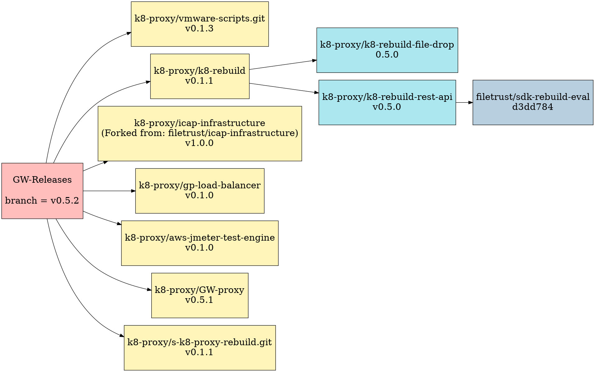
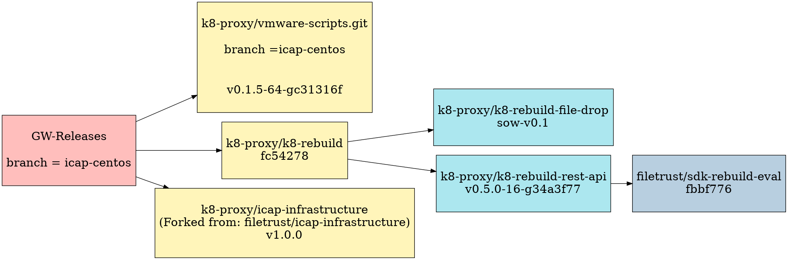

# GW-Releases

## Latest tag from main



## Branch : filedrop-centos


## Branch : icap-centos



## Relevant Repos

- [k8-rebuild](https://github.com/k8-proxy/k8-rebuild/)
    - [k8-rebuild-rest-api](https://github.com/k8-proxy/k8-rebuild-rest-api)
        - [sdk-rebuild-eval](https://github.com/filetrust/sdk-rebuild-eval)
    - [k8-rebuild-file-drop](https://github.com/k8-proxy/k8-rebuild-file-drop)
- [vmware-scripts](https://github.com/k8-proxy/vmware-scripts)
- [icap-server](https://github.com/k8-proxy/icap-infrastructure)
- [proxy-server](https://github.com/k8-proxy/s-k8-proxy-rebuild)
- [load-balancer](https://github.com/k8-proxy/gp-load-balancer)
- [traffic-generator](https://github.com/k8-proxy/aws-jmeter-test-engine)
- [GW-proxy](https://github.com/k8-proxy/GW-proxy)

## File Drop
Download [File Drop OVA]()
- File Drop AMI on AWS:
   ```
   ID: ami-0e82f434cc76a48a7
   Owner: 785217600689
   Region: eu-west-1/Ireland
   ```
- Live instances running:
   ```
   AWS: http://54.246.155.1/
   ```
## Workflows (AWS)

### Workflows Brief
- GW-Releases work with 3 main workflows
    - [icap-server](https://github.com/k8-proxy/GW-Releases/actions?query=workflow%3Aicap-server)
    - [proxy-rebuild](https://github.com/k8-proxy/GW-Releases/actions?query=workflow%3Aproxy-rebuild)
    - [k8-rebuild](https://github.com/k8-proxy/GW-Releases/actions?query=workflow%3Ak8-rebuild)
- Each commit made to the main branch triggers the workflow, but the following directories are ignored:
    - aws-jmeter-test-engine
    - gp-load-balancer
    - GW-proxy
    - s-k8-proxy-rebuild
    - k8-rebuild
    - .github/workflows/k8-rebuild.yaml
- There are 2 main jobs for each workflow:
    - build-ami
        - Configure AWS credentials
        - Setup Packer
        - Build AMI 

    
    
    - deploy-ami
        - Get current instance ID
        - Deploy AMI to dev
        - Run tests on instance
        - Delete instance(s) that fail

    

### Workflow Requirements
    - proxy-rebuild
        - branch to use workflow from
        - ICAP server IP
        - AWS region(s) where AMI will be created
        - IP of monitoring server
    - k8-rebuild
        - branch to use workflow from

### ICAP Server Workflow
- K3s ICAP - [YAML File](https://github.com/k8-proxy/GW-Releases/blob/main/.github/workflows/icap-server.yaml) 
- CK8 ICAP - [YAMl File](https://github.com/k8-proxy/k8s-compliant-kubernetes/actions/workflows/complaint-k8s-CloudSDK.yaml)
#### K3s ICAP Server Workflow

Below inputs are to be supplied for K3s based ICAP server workflow
```
icap-infrastructe branch to be used - k8-main
Extra regions where AMI should be published. Pass multiple regions with comma separated. - eu-west-1
classic vs golang (GoLang and minio based) - Golang version uses minio based golang implementation
Management UI Required - true or false
Install GW Cloud REST API - true or false
cs-k8s-api docker image - glasswallsolutions/cs-k8s-api:latest
Install filedrop UI, this will install cs-k8s-api too - true or false
Create OVA - true or false
```

- build AMI
    - Configure AWS credentials
    - Setup [Packer](https://github.com/k8-proxy/vmware-scripts/tree/main/packer)
    - Build AMI using Packer 
- deploy AMI
    - Get current instance ID and other instance IDs with the same name as current instance
    - Deploy the instance
    - Run [healthcheck tests](https://github.com/k8-proxy/vmware-scripts/tree/f129ec357284c61206edf36415b1b2ba403bff95/HealthCheck) on the instance
        - if tests are successful for current instance, all previous instances are terminated
        - if tests are failed, current instance is terminated and deleted

#### CK8 ICAP Server Workflow

Workflow [YAMl File](https://github.com/k8-proxy/k8s-compliant-kubernetes/actions/workflows/complaint-k8s-CloudSDK.yaml)

```
classic vs golang (GoLang and minio based) - Golang version uses minio based golang implementation
Management UI Required - true or false
Install GW Cloud REST API - true or false
GW Cloud REST (cs-k8s-api) API docker image - glasswallsolutions/cs-k8s-api:latest
Install filedrop UI, this will install GW Cloud REST API too - true or false
Create Workload Cluster - true or false
Create Service Cluster - true or false
Create OVA - true or false
```

All secrets specfic to Service cluster will be uploaded to  s3 bucket: `glasswall-dev-sc-logs`

### K8 Rebuild Workflow
- [YAML File](https://github.com/k8-proxy/GW-Releases/blob/main/.github/workflows/k8-rebuild.yaml)
- build AMI
    - Configure AWS credentials
    - Setup [Packer](https://github.com/k8-proxy/k8-rebuild/tree/f1ac7780d912daf033d3a801956dcb07b0164ac0/packer) 
- deploy AMI
    - Run [healthcheck tests](https://github.com/k8-proxy/vmware-scripts/tree/main/HealthFunctionalTests/filedrop) on the instance
        - if tests are successful for current instance, all previous instances are terminated
        - if tests are failed, current instance is terminated and deleted
### Proxy Rebuild Workflow
- [YAML File](https://github.com/k8-proxy/GW-Releases/blob/main/.github/workflows/proxy-rebuild.yaml)
- build AMI
    - Configure AWS credentials
    - Setup [Packer](https://github.com/k8-proxy/vmware-scripts/tree/main/packer)
    - Build AMI using Packer 
- deploy AMI
    - Get current instance ID and other instance IDs with the same name as current instance
    - Deploy the instance
    - Run tests on instance
        - Download this [PDF](https://glasswallsolutions.com/wp-content/uploads/2020/01/Glasswall-d-FIRST-Technology.pdf) file
        - Make sure it successfully has the watermark `"Glasswall Processed"`
            - if tests are successful for current instance, all previous instances are terminated
            - if tests are failed, current instance is terminated and deleted

## SOW version branches
 - ICAP server SOW version uses below repos adnd branches:
    -  GW-Releases ([icap-centos](https://githb.com/k8-proxy/GW-Releases/tree/icap-centos))
       -  vmware-scripts ([icap-centos](https://github.com/k8-proxy/vmware-scripts/tree/icap-centos))
 - File drop SOW version uses below repos and branches:
   - GW-Releases ([filedrop-centos](https://github.com/k8-proxy/GW-Releases/tree/filedrop-centos))
     - vmawre-scripts ([filedrop-centos](https://github.com/k8-proxy/vmware-scripts/tree/filedrop-centos))
     - k8-rebuild ([sow-_version](https://github.com/k8-proxy/k8-rebuild/tree/sow_version))
       - k8-rebuild-rest-api ([sow_version](https://github.com/k8-proxy/k8-rebuild-rest-api/tree/sow_version))
       - k8-rebuild-file-drop ([sow_version](https://github.com/k8-proxy/k8-rebuild-file-drop/tree/sow_version))

## ESXi-Deployment Workflow

* This workflow automatically deploys a given OVA on glasswall's ESXi server (defined in github secrets).
* Prerequisites (mandatory): 
  * Run the workflow from "ova_deployment" branch.
  * OVA's s3 download link.
  * The name of the VM created from the OVA on the ESXi server
  * choose either to run network configuration script on the VM after powering it on or not (true or false)
* Prerequisites (optional) needed if running network configuration option is set to be true:
  * IP address to be assigned to the VM after launch ex.(192.168.30.240/24) .
  * Gateway to be assigned to the VM after launch.
  * DNS server to be assigned to the VM after launch .
  * OVA username.
  * OVA password.
  * OVA base operating system (centos or ubuntu)
* Manually trigger the workflow from github **Actions**, and provide the above prerequisites.

 

## GW Cloud SDK (CS-API K8_ICAP) Workflow

* This workflow builds Cloud SDK (Integrating CS API into K8 ICAP Ubuntu) AMI and deploys to Playground account
* Prerequisites (mandatory): 
  * Run the workflow from `cs-api-k8icap` branch.
  * ICAP-infrastructe branch to be used : Contains latest stable changes for K8-ICAP :  Default : `k8-main`
  * Sow icap-infrastructure branch to be used : Contains latest SOW changes of ICAP from filetrust - Default : `main`
  * CS API Image : Latest public docker image containing CS-API code - Default : `llmsjraj/sample:latest` (To be updated with image from GW)

* Manually trigger the workflow from github **Actions**, and provide the above prerequisites.


